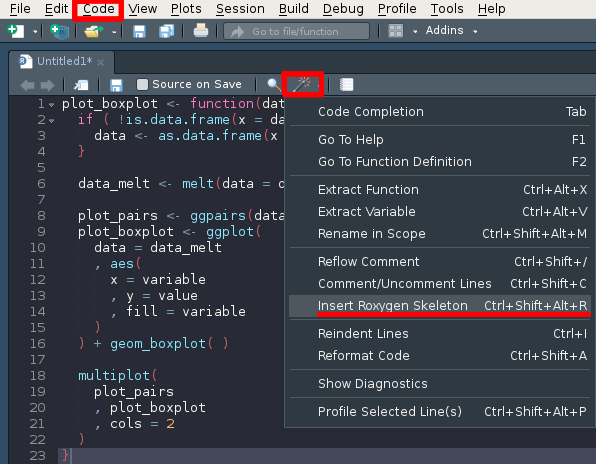

# Create R packages with `devtools`

## Package skeleton

Create a directory with the name of your package, e.g. `MyPackage`,
with inside:

* the sub-directory `R` for the R source code
* the file `DESCRIPTION` for meta-informations on your package.

```{r, eval=FALSE, echo=TRUE}
dir.create(
    path = "MyPackage" )
dir.create(
    path = paste(
        "MyPackage"
      , "R"
      , sep = .Platform$file.sep ) )
file.create(
    path = paste(
        "MyPackage"
      , "DESCRIPTION"
      , sep = .Platform$file.sep ) )
```    

### DESCRIPTION file

```{r, eval=FALSE, echo=TRUE}
cat( c(
    "Package: MyPackage"
  , "Version: 0.1"
  , "Date: 2018-02-08"
  , "Type: Package"
  , "Title: My nice package"
  , "Author: A. Arnaud"
  , "Maintainer: Alexis Arnaud <alexis.arnaud@univ-grenoble-alpes.fr>"
  , "Description: Basic simulation of genes."
  , "License: GPL-3"
  , "URL: https://github.com/AlexisArnaud/R_good_practices" )
  , file = paste(
        "MyPackage"
      , "DESCRIPTION"
      , sep = .Platform$file.sep )
  , sep = "\n"
  , append = TRUE )
```

### R code files

```{r, eval=TRUE, echo=TRUE}
cat( c(
 "generate_fakestudy <- function(n_genes) {
  start = unique(round(stats::runif(n_genes)*1000000))
  gene_list = data.frame(chr='chr1',
                         start =start,
                         stop = start + round(abs(stats:: rnorm(length(start)) * 10000)),
                         gene_id='gene',
                         score = 'NA',
                         strand = ifelse(stats::runif(length(start))>0.5, '+', '-'),
                         ref_genome='simu',
                         stringsAsFactors=FALSE)
  gene_list$gene_id = paste0('gene_', 1:length(start))
  rownames(gene_list) = gene_list$gene_id
  utils::head(gene_list)
  dim(gene_list)
  return(gene_list)
  }" )
  , file = paste("MyPackage", "R", "simulation.R", sep = .Platform$file.sep)
  , sep = "\n"
  , append = FALSE )
```

## R code documentation

Use the Roxygen templates to start the documentation:
```{r, out.width="75%"}

```

## R code documentation

And fill the Roxygen fields in order to best describe your function:

* Title of the function
* @description Some description
* @param <parameter name> name of each parameter and a short description (type, default value ...)
* @return value of the function output
* @author author of the function
* @seealso link to other functions or packages, e.g. \code{ \link[GGally]{ggpairs} } 
* @keywords some keywords for the code indexation
* @examples one or several examples on how to use the function
* @importFrom <package name> <function name> to import some package or functions during the installation and the loading of the function
* @export

## Documentation generation with roxygen2

```{r, eval=TRUE, echo=TRUE}
cat( c(
 "#---------------------------------------------
  #'Generate simulated dataset.
  #'
  #'A bedfile (gene information).
  #'
  #'@param n_genes A number of genes to simulate
  #'@return a matrix with informations on simulated genes
  #'@author J. Doe
  #'@examples generate_fakestudy(n_genes = 500)
  #'@export
  generate_fakestudy <- function(n_genes) {
  start = unique(round(stats::runif(n_genes)*1000000))
  gene_list = data.frame(chr='chr1',
                         start =start,
                         stop = start + round(abs(stats:: rnorm(length(start)) * 10000)),
                         gene_id='gene',
                         score = 'NA',
                         strand = ifelse(stats::runif(length(start))>0.5, '+', '-'),
                         ref_genome='simu',
                         stringsAsFactors=FALSE)
  gene_list$gene_id = paste0('gene_', 1:length(start))
  rownames(gene_list) = gene_list$gene_id
  utils::head(gene_list)
  dim(gene_list)
  return(gene_list)
  }" )
  , file = paste("MyPackage", "R", "simulation.R", sep = .Platform$file.sep)
  , sep = "\n"
  , append = FALSE )
```

## Package construction

```{r, eval=FALSE, echo=TRUE}
if ( !( "devtools" %in% installed.packages( ) ) ) {
    install.packages(pkgs = "devtools")
}
devtools::document("MyPackage")
devtools::check("MyPackage")
devtools::build("MyPackage")
devtools::install_local(path = "MyPackage_0.1.tar.gz", force = TRUE)
```

## Test

```{r, eval=TRUE, echo=TRUE}
n_genes <- 500

simulation <- MyPackage::generate_fakestudy(n_genes = n_genes)
head(x = simulation)
dim(x = simulation)
```

## References

To complete:

* https://github.com/r-lib/devtools
* http://r-pkgs.had.co.nz/intro.html
* https://cran.r-project.org/doc/contrib/Leisch-CreatingPackages.pdf
* http://kbroman.org/pkg_primer/
* https://github.com/klutometis/roxygen
* http://r-pkgs.had.co.nz/
* https://support.rstudio.com/hc/en-us/articles/200486488-Developing-Packages-with-RStudio
* https://www.r-bloggers.com/how-to-write-and-debug-an-r-function/
* https://nicercode.github.io/guides/functions/
* https://swcarpentry.github.io/r-novice-inflammation/06-best-practices-R/
