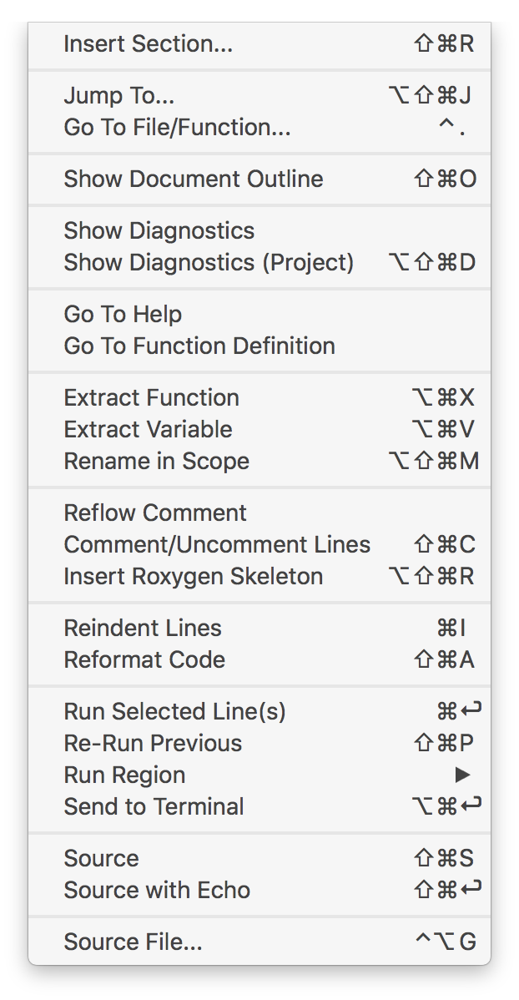
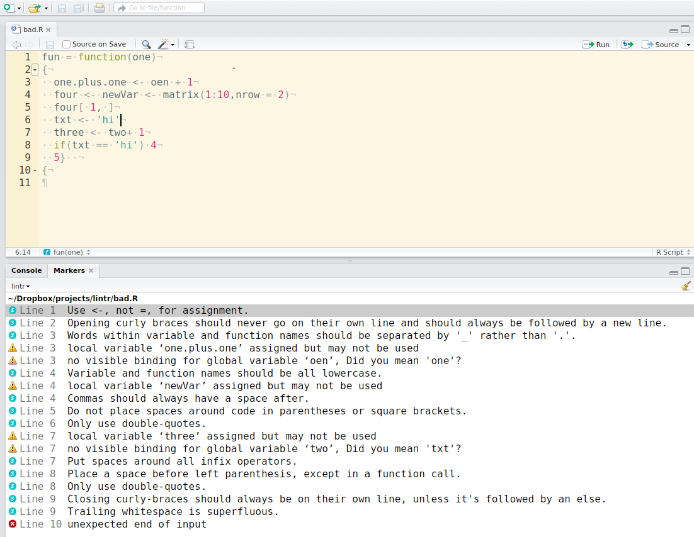
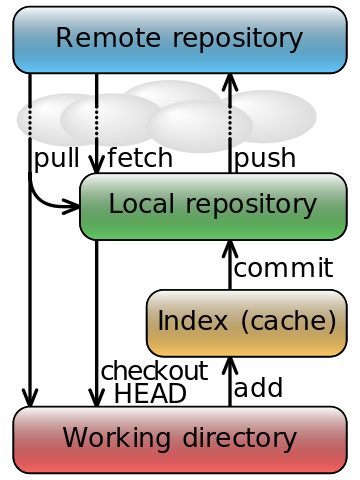
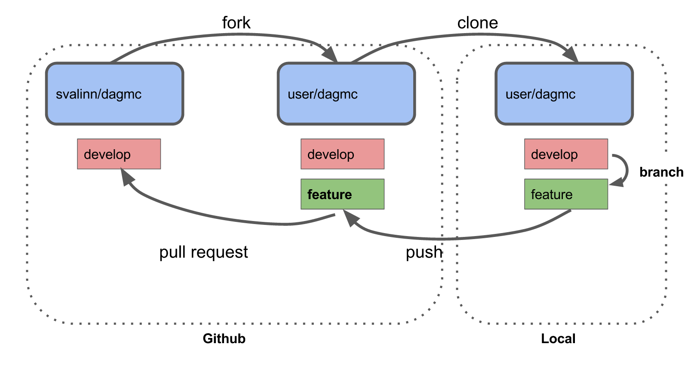

```{r setup, include=FALSE}
#options(htmltools.dir.version = FALSE)
knitr::opts_chunk$set(echo = TRUE, eval = FALSE, fig.align = "center", dev = "svg")
```

# R coding style

---

## Names and structure

### File names

```{r}
# Good
fit_models.R
utility_functions.R

# Bad
fit models.R
foo.r
stuff.r
```

**Prefer file names that are all lower case, and never have names that differ only in their capitalization.**

---

### Structure of the scripts


```{r}
# Load data --------------------------------------------------------------------

# Plot data ====================================================================

## Pacakge dependencies
##  - zip : generation of 'zip' file
## ========================================================================== ##
```

---

## Syntax

### Object names

Strive for names that are concise and meaningful.

```{r}
# Good : snake case
day_one
day_1

# Acceptable : CamelCase
DayOne

# Bad
first_day_of_the_month
dayone
djm1

# Error : lisp-case
# day-one
```

---

**Avoid using already existing names !**

```{r}
# VERY BAD
T <- FALSE
c <- 10
mean <- function(x) sum(x)
```

---

### Spacing

Any style guide is fundamentally opinionated...

```{r}
# Good : Hadley
x[, 1]
average <- mean((feet / 12) + inches, na.rm = TRUE)
sqrt(x^2 + y^2)
x <- 1:10
base::get

# Good : Alexis
average <- mean(
    x     = ( feet / 12 ) + inches 
  , na.rm = TRUE
)
sqrt(x = x^2 + y^2 )
x <- 1:10 ## seq_len(length.out = 10)
base::get

# Bad in any cases
average<-mean(feet/12 + inches,na.rm=TRUE)
sqrt(x ^ 2 + y ^ 2)
x <- 1 : 10
base :: get
```

---

### Indenting and code blocks

- { is the last character of a line
- the content is indented by two spaces
- } is the first character of a line

```{r}
# Good
if (y < 0 && debug) {
  message("y is negative")
}

# Bad
if (y < 0 && debug)
  message("Y is negative")
```

---

### Long lines

Strive to limit your code to 80 characters per line.

```{r}
# Good
do_something_very_complicated(
  something = "that",
  requires  = many,
  arguments = "some of which may be long"
)

# Or
do_something_very_complicated(
    something = "that"
  , requires  =  many
  , arguments = "some of which may be long"
)

# Bad
do_something_very_complicated("that", requires, many, arguments,
                              "some of which may be long"
)
```

---

### Assignment

```{r}
# Good
x <- 5

# Bad
x = 5 
```

- `=`  should be used to give parameters values in a function, 
- `<-` should be used to give a value to an object.

---

Don't mix **=** and **<-** !

```{r, eval = TRUE}
# x <- y = 5 ## ERROR
x <- {y = 5}
x
y
# median( z=1:10   ) ## ERROR
median( { z=1:10 } )
z
median(  z <- 1:10 )
z
```

---

## Automatic styling

You can use `Ctrl + Shift + A` or `Command + Shift + A` or 

*Rstudio > Code > Reformat code*

```{r, out.width="20%", echo = FALSE, eval = TRUE}

```

Or `lintr`, `styler` packages

```{r}
install.packages(pkgs = c("lintr", "styler" )
```

---

### lintr package

Checks adherence to a given style, syntax errors and possible semantic issues. It can be used on the fly on a source file, eg `bad_style.R` :

```{r, eval = TRUE}
lintr::lint(filename = "bad_style.R")
```

---

### lintr package

```{r, out.width="90%", echo = FALSE, eval = TRUE}

```

---

### styler package

You can use the `style_text()` function as follows

```{r, eval = TRUE}
ugly_code <- "a<-function( x){1+1}           "
styler::style_text(text = ugly_code)
```

**Beware, if you apply the `styler` package on a R file or a directly, it will overwrite your files !**

---

### styler package

```{r, out.width="100%", echo = FALSE, eval = TRUE}
knitr::include_graphics("fig/R_styler_example.gif")
```

---

## Other tidying packages

**Get automatic advice about your package**

Install and run `goodpractice` package for *Advice (that) includes functions and syntax to avoid, package structure, code complexity, code formatting, etc.*

!!Not working anymore!!

**Remove typos!**

Use the `devtools::spell_check()` function. 

---

## Saving files 

When saving files in R, you may overwrite existing files without being noticed.

To ensure you are not overwriting a file, you may type

```{r}
name <- "name.Rdata"
if ( !file.exists( name ) ) save(data, file = name)
``` 

---

## References

To complete:

- http://style.tidyverse.org/
- https://cran.r-project.org/web/packages/rockchalk/vignettes/Rstyle.pdf
- https://journal.r-project.org/archive/2012-2/RJournal_2012-2_Baaaath.pdf
- https://cran.r-project.org/doc/manuals/R-ints.html
- https://google.github.io/styleguide/Rguide.xml
- https://www.r-project.org/conferences/useR-2004/Keynotes/Maechler.pdf
- https://stat.ethz.ch/Teaching/maechler/R/useR_2014/Maechler-2014-pr.pdf
- http://andrewgelman.com/2007/09/18/style_guide_for/
- http://blog.jom.link/ten_rules_reproductible_research.html

---

# Versioning using Git

---

## Introduction to Git

### What is Git

Git is a free and open source distributed version control system designed to handle everything from small to very large projects with speed and efficiency.

- A versionning system (Git)

- A collaborative system (publish and share your code on a platform)

[Git website](https://git-scm.com/)

[Install git](https://git-scm.com/downloads)

[Git introducing video](https://git-scm.com/video/what-is-version-control)

[RStudio and Git](http://r-pkgs.had.co.nz/git.html)

---

### What is Git



---


### What is Git

Git is a free and open source distributed version control system designed to handle everything from small to very large projects with speed and efficiency.

- => 3 main commands: commit, push, and pull

    - pull:   update your local project with the latest version of the main project
    - commit: add your latest contribution/modification
    - push:   merge your modifications with the main project
  
Simple commands are available in RStudio, otherwise you need to use Git from the shell ([Git cheat sheet](https://services.github.com/on-demand/downloads/github-git-cheat-sheet.pdf))

---

### Git platforms (share your code, collaborate)

- [GitHub](https://github.com), [documentation](https://guides.github.com/activities/hello-world/)

- [GitLab UGA](https://gricad-gitlab.univg-renoble-alpes.fr), [documentation](https://docs.gricad-pages.univ-grenoble-alpes.fr/help/)

---

## How to use Git (integration with RStudio)  

**Tutorial time**

---

### Create a new local Git repository

- RStudio > New Project > New directory > R packages *or* New Project + create a git repository
- Go to the git menu, on the top-right, and add your files of interest: 
  - save your changes, 
  - open the commit window, 
  - select files, 
  - stage files, 
  - write a commit message, 
  - commit

---

### Link your repository  to a new GitHub repository

- RStudio > New Project > New directory > R packages *or* New Project + create a git repository
- Go to the git menu, on the top-right, and add your files of interest: 
- Synchronising with GitHub. Go to RStudio > Tools > Shell
  - create a new repo on [GitHub](https://github.com/new) and give it the same name as your package
  - push your local respository from the command line
 `git remote add origin https://github.com/AlexisArnaud/R_tests.git
 `git push -u origin master`
- Check that your GitHub repository is updated

---

### Publishing your code on GitHub (or Gitlab...)

- Change something (modify or create a R file)
- Go to the git menu, on the top-right, and add your files of interest: 
  - save your changes, 
  - open the commit window, 
  - select files, 
  - stage files, 
  - write a commit message, 
  - commit
  - **push**
- Check that your GitHub repository is updated

---

### Import a GitHub repository into RStudio

- On GitHub: [create new repo](https://github.com/new) with a README and a description. Leave all the other options as is, then click Submit. (no license, no gitignore...)
- **CLONE** your repository. **Copy** the web URL
- In RStudio: Create a New Project > Version Control > Git and **paste** the web URL of the project. Congratulation, you have cloned your new repo.
- => You now have access to Git functionalities within Rstudio

---

### Collaborative work on GitHub

- Equal collaborators: Everyone can pull, commit and push on the same 'master' branch
- One coordinator (master branch, owns the project) and one (or more) contributor:



---

### Collaborative work on GitHub

- Equal collaborators: Everyone can pull, commit and push on the same 'master' branch
- One coordinator (master branch, owns the project) and one (or more) contributor:
  - Fork the original repository
  - Clone it, and link it to the master repository 
    `git remote add upstream https://github.com/AlexisArnaud/R_tests.git`
  - Uptade your fork with latest changes form the master repository (fetch and merge) 
    `git pull upstream master`
- Commit, push on your fork, and create a [Pull Request](https://help.github.com/articles/creating-a-pull-request/) (that will be reviewed and accepted by the master)

---

# Create a R package

---

- Use Git to fork the repository https://github.com/AlexisArnaud/R_good_practices.git
- Read the Rmd file 'Create_R_package.Rmd'.
- Modify the file with your own code.
- Run the Rmd file :
  ```{r}
  rmarkdown::render(input = "Create_R_package.Rmd")
  ```
  
**Don't hesitate to make a pull request if you want to modify or improve this repository :)**

---

```{r, echo = FALSE, eval = TRUE, child = "Create_R_package.Rmd"}
```

---

# Thanks!

Presentation available at

https://github.com/AlexisArnaud/R_good_practices.git


GitHub: [AlexisArnaud](https://github.com/AlexisArnaud)
